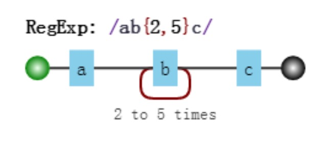
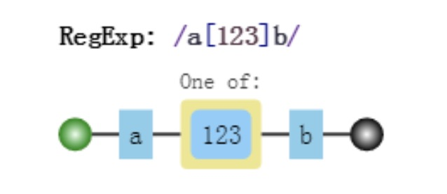

# 字符匹配

正则表达式是匹配模式, 要么匹配字符, 要么匹配位置.

## 模糊匹配

模糊匹配有两种形式, 分别是 **横向模糊匹配** 和 **纵向模糊匹配**.

### 横向模糊匹配

使用量词 `{m,n}` 来匹配某个字符出现的个数. 如下面的例子中, 匹配的字符串必须满足: 第一个字符是 a, 最后一个字符是 c, 中间的 b 可以出现 1~4 次.



```js
const regex = /ab{1,4}c/g

const str = 'abc abbc abbbc abbbbc abbbbbc'

str.match(regex) // [ 'abc', 'abbc', 'abbbc', 'abbbbc' ]
```

> TIPS
>
> 关于 String 的 match 方法可参照 [JavaScript API 全解析](https://js.yanceyleo.com/ES/String/match).

### 纵向模糊匹配

使用字符组 `[xyz]` 来匹配某个位置应该出现的字符.



```js
const regex = /a[123]c/g

const str = 'a1c a2c a3c a4c'

str.match(regex) // [ 'a1c', 'a2c', 'a3c' ]
```

## 字符组

字符组用于纵向模糊匹配, 它匹配某个位置可以是哪些字符.

### 范围表示法

如果字符组匹配的字符表示一个范围, 可使用 **范围表示法**.

```js
const regexp = /[123456abcdefGHIJKLM]/

// 上面的正则表达式可简化成如下形式
const simplifyRegexp = /[1-6a-fG-M]/
```

通过上面的例子可以看出 `-` 在正则表达式中有特定的含义, 如果恰好要匹配 `-` 这个字符, 需要用到 **转义**, 或把 `-` 字符放到字符组的开头或结尾.

```js
// 下面是纵向匹配 abcde
const regexp = /[a-e]/

// 若想匹配 - 这个字符, 需要转义
const regexp = /[a\-e]/

// 或者放到开头或结尾
const regexp = /[-ae]/
const regexp = /[ae-]/
```

### 排除字符组

即匹配除字符组以外的字符, 如 `/A[^a-c]B/`, 第二个字符是除 a, b, c 以外的任何字符.

```js
const regex = /A[^a-c]B/g

const str = 'AaB AbB AcB AdB'

str.match(regex) // [ 'AdB' ]
```

### 内置字符组

正则表达式内置了一些字符组的简写形式, 可参照如下表格.

| 字符组 | 含义                                                                             |
| :----: | :------------------------------------------------------------------------------- |
|   \d   | 等价于 `/[0-9]/`, 表示匹配一个数字字符. d 是 digit 的缩写.                       |
|   \D   | 等价于 `/[^0-9]/`, 表示匹配一个非数字字符.                                       |
|   \w   | 等价于 `/[0-9a-zA-Z_]/`, 表示匹配一个数字, 大小写字母或下划线. w 是 word 的缩写. |
|   \W   | 等价于 `/[^0-9a-zA-Z_]/`, 表示匹配一个非单词字符.                                |
|   \s   | 等价于 `/[ \t\v\n\r\f]/`, 表示匹配一个空白符. s 是 space 的缩写.                 |
|   \S   | 等价于 `/[^0-9a-zA-Z_]/`, 表示匹配一个非空白符.                                  |
|   .    | 等价于 `/[^\n\r\u2028\u2029]/`, 表示通配符.                                      |

> TIPS
>
> 匹配任意字符可使用 `/[\d\D]/`、`/[\w\W]`/、`/[\s\S]`/ 和 `/[^]`/ 的任意一个.

## 量词

字符组用于横向模糊匹配, 它匹配一个字符出现的次数.

### 内置量词

| 量词  | 含义                                 |
| :---: | :----------------------------------- |
| {m,n} | 至少出现 m 次, 至多出现 n 次.        |
| {m,}  | 至少出现 m 次.                       |
|  {m}  | 等价于 {m,m} 表示必须出现 m 次.      |
|   ?   | 等价于 {0,1} 表示要么出现要么不出现. |
|   +   | 等价于 {1,+} 表示至少出现一次.       |
|  \*   | 等价于 {0,} 表示出现任意次.          |

### 贪婪匹配和惰性匹配

贪婪与惰性模式影响的是被量词修饰的子表达式的匹配行为, 贪婪模式在整个表达式匹配成功的前提下, 尽可能多的匹配; 而惰性模式在整个表达式匹配成功的前提下, 尽可能少的匹配.

下面的示例是经典的爬虫正则. 第一个是贪婪匹配, 在匹配到第一个 `</div>` 时已经可以使整个表达式匹配成功, 但由于采用的是贪婪模式, 所以仍然要向右尝试匹配, 查看是否还有更长的可以成功匹配的子串，在匹配到第二个 `</div>` 后, 向右再没有可以成功匹配的子串, 此时匹配结束. 对于惰性匹配, 它会从左到右找出字符串中每个可以配对的 `<div>` 和 `</div>` 进行匹配, 找到一对就算一对.

```js
const str = '<main><div>test1</div>bb<div>test2</div><main/>'

// 贪婪匹配
str.match(/<div>.*<\/div>/g) // [ '<div>test1</div>bb<div>test2</div>' ]

// 惰性匹配
str.match(/<div>.*?<\/div>/g) // [ '<div>test1</div>', '<div>test2</div>' ]
```

下面这个例子, 正则匹配 2-5 位的数字. 对于贪婪匹配, 它会尽量匹配**多**的字符, 也就是子串有 5 位就能匹配到 5 位, 有 3 位就能匹配到 3 位; 而对于惰性匹配, 它会尽量**少**的匹配字符, 也就是尽量以 2 位去匹配.

```js
const str = '123 1234 12345 123456'

// 贪婪匹配
str.match(/\d{2,5}/g) // [ '123', '1234', '12345', '12345' ]

// 惰性匹配
str.match(/\d{2,5}?/g) // [ '12', '12', '34', '12', '34', '12', '34', '56' ]
```

因此, 对于上述的量词, 通过后面加一个 `?` 可实现其惰性形式.

| 惰性量词 | 贪婪量词 |
| :------: | :------: |
|  {m,n}?  |  {m,n}   |
|  {m,}?   |   {m,}   |
|    ??    |    ?     |
|    +?    |    +     |
|   \*?    |    \*    |
