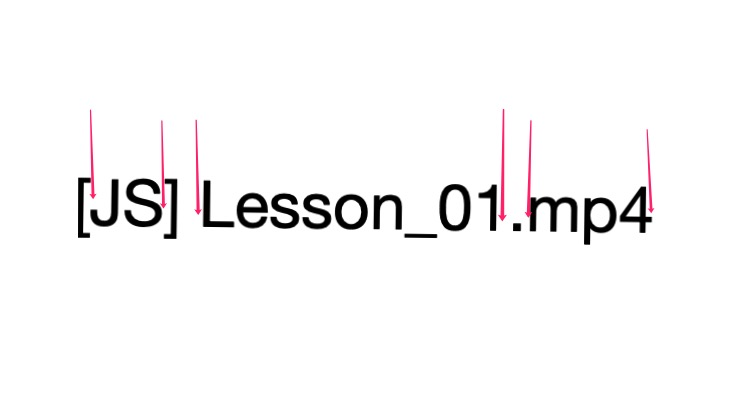

# 位置匹配

位置(也称为锚)是指每个字符之间的"空隙", 如下图箭头所指即为位置.


在 ES5 中有 6 种锚, 具体如下.

|  锚   | 含义                                                                      |
| :---: | :------------------------------------------------------------------------ |
|   ^   | 匹配开头, 在多行匹配中匹配行开头.                                         |
|  \$   | 匹配结尾, 在多行匹配中匹配行结尾.                                         |
|  \b   | 匹配 \w 和 \W 之间的位置, 也包括 \w 与 ^ 之间的位置和 \w 与 \$ 之间的位置 |
|  \B   | 匹配非 \w 和 \W 之间的位置                                                |
| (?=p) | 匹配子模式 p 前面的位置                                                   |
| (?!p) | 匹配子模式 p 后面的位置                                                   |

- [`^` 和 `$`](#%5E-%E5%92%8C-)
- [`\b` 和 `\B`](#%5Cb-%E5%92%8C-%5Cb)
- [`(?=p)` 和 `(?!p)`](#p-%E5%92%8C-p)
- [位置的特性](#%E4%BD%8D%E7%BD%AE%E7%9A%84%E7%89%B9%E6%80%A7)
- [训练营](#%E8%AE%AD%E7%BB%83%E8%90%A5)
  - [不匹配任何东西的正则](#%E4%B8%8D%E5%8C%B9%E9%85%8D%E4%BB%BB%E4%BD%95%E4%B8%9C%E8%A5%BF%E7%9A%84%E6%AD%A3%E5%88%99)
  - [数字的千位分隔符表示法](#%E6%95%B0%E5%AD%97%E7%9A%84%E5%8D%83%E4%BD%8D%E5%88%86%E9%9A%94%E7%AC%A6%E8%A1%A8%E7%A4%BA%E6%B3%95)
  - [验证密码问题](#%E9%AA%8C%E8%AF%81%E5%AF%86%E7%A0%81%E9%97%AE%E9%A2%98)

## `^` 和 `$`

`^` 和 `$` 分别匹配一个字符串的开头和结尾. 下面的例子就是给 `hello, world.` 这个字符串的开头和结尾添加 🔞.

```js
const regExp = /^|$/g

'hello, world.'.replace(regExp, '🔞') // 🔞hello, world.🔞
```

此外, 它们还可以匹配多行字符串, 这需要给正则表达式缀上修饰符 `m`.

```js
const regExp = /^|$/gm

// 🎄Merry🎄
// 🎄Christmas.🎄
'hello, world.'.replace(regExp, '🎄')
```

## `\b` 和 `\B`

`\b` 匹配单词边界，具体就是 `\w` 与 `\W` 之间的位置，也包括 `\w` 与 `^` 之间的位置，和 `\w` 与 `$` 之间的位置. 复习一下 `\w`, 它等价于 `/[0-9a-zA-Z_]/`, 表示匹配一个数字, 大小写字母或下划线. 看下面这个例子:

```js
'[JS] Lesson_01.mp4'.replace(/\b/g, '#') // [#JS#] #Lesson_01#.#mp4#
```

下面箭头所指向的位置, 要么是 `\w` 与 `\W` 之间的间隙, 要么是 `\w` 与开头或结尾的间隙. `\b` 即匹配这些间隙位置.



同理, `\B` 与 `\b` 相反, 它匹配 `\w` 之间的位置, 以及 `\W` 与 `^` 和 `$` 之间的位置.

```js
'[JS] Lesson_01.mp4'.replace(/\B/g, '#') // #[J#S]# L#e#s#s#o#n#_#0#1.m#p#4
```

## `(?=p)` 和 `(?!p)`

## 位置的特性

## 训练营

### 不匹配任何东西的正则

### 数字的千位分隔符表示法

### 验证密码问题
