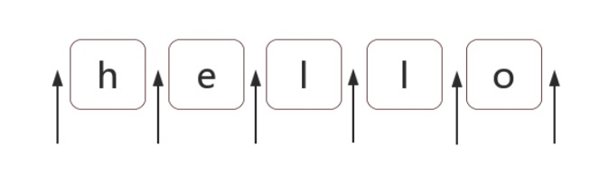

# 位置匹配

位置(也称为锚)是指每个字符之间的"空隙", 如下图箭头所指即为位置.

在 ES5 中有 6 种锚, 具体如下.

| 锚  | 含义                              |
| :-: | :-------------------------------- |
|  ^  | 匹配开头, 在多行匹配中匹配行开头. |
| \$  | 匹配结尾, 在多行匹配中匹配行结尾. |
| ??  | ?                                 |
| +?  | +                                 |
| \*? | \*                                |

- [`^` 和 `$`](#%5E-%E5%92%8C-)
- [`\b` 和 `\B`](#%5Cb-%E5%92%8C-%5Cb)
- [`(?=p)` 和 `(?!p)`](#p-%E5%92%8C-p)
- [位置的特性](#%E4%BD%8D%E7%BD%AE%E7%9A%84%E7%89%B9%E6%80%A7)
- [训练营](#%E8%AE%AD%E7%BB%83%E8%90%A5)
  - [不匹配任何东西的正则](#%E4%B8%8D%E5%8C%B9%E9%85%8D%E4%BB%BB%E4%BD%95%E4%B8%9C%E8%A5%BF%E7%9A%84%E6%AD%A3%E5%88%99)
  - [数字的千位分隔符表示法](#%E6%95%B0%E5%AD%97%E7%9A%84%E5%8D%83%E4%BD%8D%E5%88%86%E9%9A%94%E7%AC%A6%E8%A1%A8%E7%A4%BA%E6%B3%95)
  - [验证密码问题](#%E9%AA%8C%E8%AF%81%E5%AF%86%E7%A0%81%E9%97%AE%E9%A2%98)

## `^` 和 `$`

## `\b` 和 `\B`

## `(?=p)` 和 `(?!p)`

## 位置的特性

## 训练营

### 不匹配任何东西的正则

### 数字的千位分隔符表示法

### 验证密码问题
